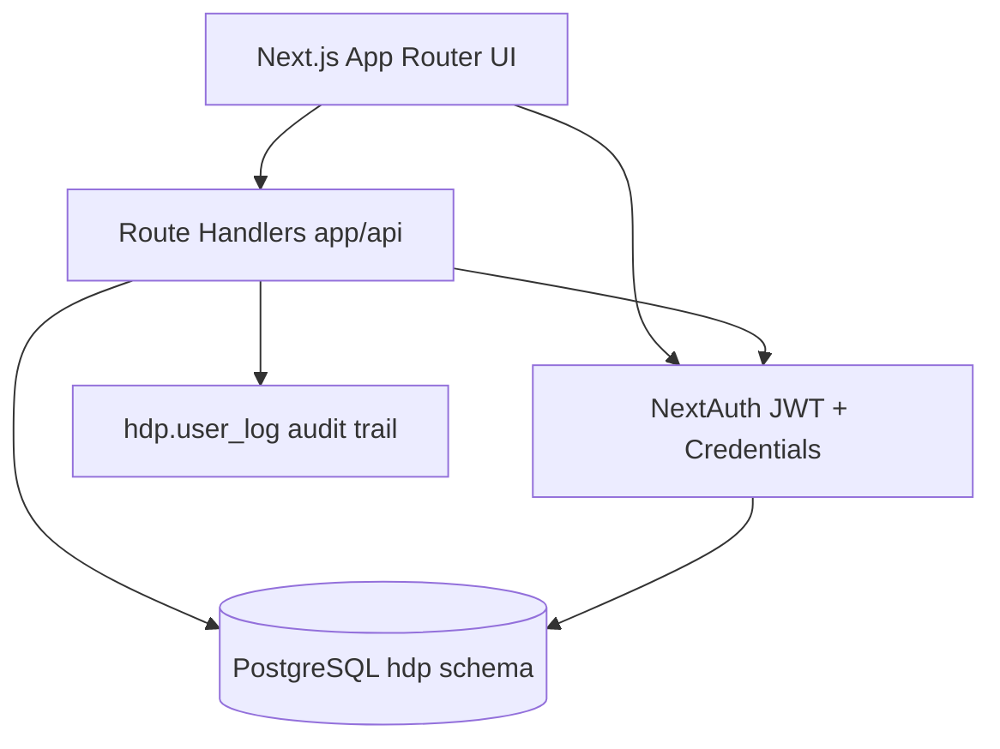
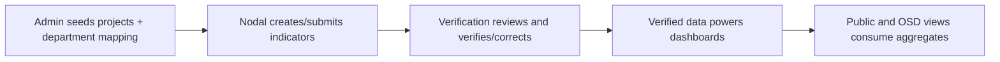

# HDP 2026 Technical Context Handbook

Project: HDP (Hundred Days Programme) Kerala CMO portal rebuild
Codebase: Next.js 15 + TypeScript + Tailwind + ShadCN + Drizzle + PostgreSQL (hdp schema) + NextAuth v5

This handbook is a practical technical briefing for future onboarding, demos, and architecture discussions.

---

## 1. What This Project Is

HDP is a role-based government programme tracking portal.

- Admin creates and governs projects/users.
- Nodal Officer submits progress and evidence.
- Verification Officer verifies or corrects submissions.
- OSD Admin monitors executive KPIs and bottlenecks.
- Public users consume published progress dashboards without login.

Primary reference blueprint: HDP_Platform_Blueprint_v2.md

---

## 2. Stack and Runtime Model

## Frontend

- Next.js 15 App Router
- React 19
- Tailwind CSS + ShadCN UI components

## Backend

- Next.js Route Handlers (`app/api/**/route.ts`)
- Node runtime for DB/bcrypt work (`export const runtime = 'nodejs'` in key APIs)

## Data

- PostgreSQL schema: `hdp`
- Drizzle ORM with SQL-heavy query style

## Auth

- NextAuth v5 with JWT session strategy
- Credentials provider with bcrypt password compare

## Validation

- Zod used in forms and API handlers

---

## 3. High-Level Architecture

---

## 4. Role Model and Permissions

Role IDs from session and DB:

- `1`: Verification Officer
- `2`: Nodal Officer
- `3`: Admin (Tech Admin)
- `4`: OSD Admin

Current role behavior in middleware/auth callbacks:

- Role 2 blocked from `/verify/*`; redirected to officer area.
- Role 1 blocked from `/officer/*`; redirected to verify area.
- Role 4 forced into `/admin/osd/*` and redirected away from general `/admin/*`.
- Role 3 blocked from `/admin/osd/*`; redirected to `/admin/dashboard`.
- Non-admin users blocked from `/admin/*`.

Key files:

- auth.config.ts
- middleware.ts
- lib/auth/session.ts
- lib/auth/admin-session.ts
- lib/auth/verifier-session.ts

---

## 5. Authentication and Session Logic

## 5.1 Edge-safe auth for middleware

- `auth.config.ts` is edge-safe (no DB/bcrypt).
- Handles route protection and redirect logic using JWT session payload.

## 5.2 Full credentials auth

- `auth.ts` handles:
  - `login_name` lookup in `hdp.user_details`
  - bcrypt password compare
  - inactive user check
  - lockout check (`failed_login_attempts`, `locked_until`)
  - lockout thresholds via env:
    - `ACCOUNT_LOCKOUT_THRESHOLD` (default 5)
    - `ACCOUNT_LOCKOUT_MINUTES` (default 30)
  - login success/failure audit events

## 5.3 Session freshness strategy

- `requireSession()` re-reads `role_id` and `sec_id` from DB every request.
- Purpose: prevent stale JWT role/department behavior after admin edits.

## 5.4 Post-login redirect logic

- Login form calls `/api/auth/session` and redirects by role:
  - Role 4 -> `/admin/osd/dashboard`
  - Role 3 -> `/admin/dashboard`
  - Role 2 -> `/officer/projects`
  - Role 1 -> `/verify/projects`

Key file:

- components/forms/LoginForm.tsx

---

## 6. Route Group Map (UI)

From current `app/**/page.tsx` inventory:

## Public

- `/` and `/public/*` reporting pages
- department, district, sector, project detail, gallery pages

## Auth

- `/login`
- `/forgot-password`
- `/reset-password`
- `/change-password`

## Officer (Nodal)

- project listing
- project indicator listing
- indicator create/edit/progress/upload/video flows
- officer change-password

## Verify (Verification Officer)

- verify projects list
- project indicators and verification pages
- verify upload/video pages
- verify change-password

## Admin (Tech Admin)

- `/admin/dashboard`
- `/admin/projects` + create/edit
- `/admin/users` + create/edit
- `/admin/audit`
- `/admin/reports`
- `/admin/settings/change-password`

## OSD Admin

- `/admin/osd/dashboard`

---

## 7. API Surface (Current)

There are 33 route handlers under `app/api/**/route.ts`.

Major groups:

## Auth/session

- `/api/auth/[...nextauth]`
- `/api/auth/change-password`
- `/api/me`

## Officer

- `/api/officer/projects`
- `/api/officer/projects/[projectId]/indicators`
- `/api/officer/indicators/[indicatorId]/progress`
- `/api/officer/indicators/[indicatorId]/gallery`
- `/api/officer/indicators/[indicatorId]`
- `/api/officer/master`

## Verify

- `/api/verify/projects`
- `/api/verify/projects/[projectId]/indicators`
- `/api/verify/indicators/[indicatorId]/verify`
- `/api/verify/indicators/[indicatorId]/history`
- `/api/verify/indicators/[indicatorId]/gallery`
- `/api/verify/projects/[projectId]/complete`

## Admin

- `/api/admin/dashboard`
- `/api/admin/osd/dashboard`
- `/api/admin/projects` + `/[id]`
- `/api/admin/users` + `/[id]`
- `/api/admin/master`
- `/api/admin/audit`
- `/api/admin/reports/[reportId]`

## Public

- `/api/public/dashboard`
- `/api/public/departments`
- `/api/public/departments/[departmentPublicId]` (canonical; aliases to legacy handler)
- `/api/public/department/[secId]` (legacy)
- `/api/public/sectors/[sectorPublicId]` (canonical alias route)
- `/api/public/sector/[sectorId]/departments` (legacy)
- `/api/public/sectors/[sectorPublicId]/departments` (canonical alias route)
- `/api/public/sector/[sectorId]` (legacy)
- `/api/public/sectors`
- `/api/public/projects/[projectPublicId]` (canonical; aliases to legacy handler)
- `/api/public/project/[projectId]` (legacy)
- `/api/public/district/[district_id]` (legacy)
- `/api/public/districts/[districtPublicId]` (canonical alias route)
- `/api/public/nature-summary`

### Public route deprecation window

- Legacy public page aliases remain active during transition and redirect to canonical plural routes.
- Sunset target for legacy page aliases: `2026-12-31`.
- Legacy alias hits are logged server-side with `[legacy-alias-hit]` for rollout monitoring.
- Canonical pages and endpoints should be used for all new links and integrations.
- Canonical public API alias routes emit redirect telemetry headers: `Deprecation`, `Sunset`, `Link`, `X-Alias-Redirect`, `X-Alias-Source`, `X-Legacy-Handler`.

---

## 8. Business Workflow (End-to-End)

## 8.1 Admin workflow

1. Create users and assign role/department.
2. Create projects and map to one or more departments (`project_secretary`).
3. Monitor audit/reports/system stats.
4. OSD role sees separate executive dashboard.

## 8.2 Nodal Officer workflow

1. View projects scoped by `sec_id`.
2. Create indicators for owned projects.
3. Submit progress values and employment achievements.
4. Upload supporting media/docs.

## 8.3 Verification Officer workflow

1. View indicators pending verification.
2. Verify submitted values.
3. Optionally correct values; corrections are audited.
4. Mark as verified (sets verifier fields and `verified_date`).

## 8.4 OSD workflow

1. Monitor cross-cutting KPIs (verification pressure, district/sector/department performance).
2. Use action rail to jump to intervention sections.

---

## 9. Key Logic and Calculations Used

## 9.1 Indicator percentage

In officer progress update, percentage is written as:

- `percentage = min(100, physical_achievement / physical_target * 100)`
- If target is 0/null -> 0

## 9.2 Unit-aware validation

For officer progress update:

- If unit is `Percentage`, physical achievement max = 100.
- Else max = `physical_target`.
- If computed completion is 100%, completion date is required.

## 9.3 Verifier percentage

In verify handler:

- `verified_percentage = min(100, verified_physical_achievement / physical_target * 100)`

## 9.4 OSD dashboard composite score

Department ranking score uses weighted formula:

- Physical achievement weight: 45%
- Financial achievement weight: 35%
- Completion ratio weight: 20%

## 9.5 Live profile freshness

`/api/me` reads live user row for name/designation/status to avoid stale header/session display.

---

## 10. Data Model Snapshot (hdp schema)

Primary tables used in code:

## User/security

- `hdp.user_details`
- `hdp.master_role`
- `hdp.password_reset_tokens`
- `hdp.session_blocklist`

## Project/master

- `hdp.master_projects`
- `hdp.project_secretary`
- `hdp.master_secretary`
- `hdp.master_district`
- `hdp.master_sector`
- `hdp.master_localbody`
- `hdp.master_localbody_type`
- `hdp.master_beneficiary`

## Progress/evidence

- `hdp.indicators`
- `hdp.gallery`
- `hdp.documents`

## Audit

- `hdp.user_log`

Schema files:

- lib/db/schema/user.ts
- lib/db/schema/master.ts
- lib/db/schema/indicator.ts
- lib/db/schema/audit.ts

---

## 11. Audit and Observability

Audit writes are centralized through `writeAudit()`:

- Captures user id, action, entity/entity id, outcome, sec id, metadata
- Captures request IP and user-agent
- Writes to `hdp.user_log`

Common action codes include:

- login success/failure
- account locked
- indicator created/submitted/approved/corrected/rejected
- media uploaded/deleted
- password events
- user/project CRUD events

---

## 12. Admin vs OSD Separation

Current separation has three layers:

1. Middleware/authorized callback role redirects
2. Admin session guards allow roles 3 and 4 but route logic isolates OSD area
3. Admin layout nav changes by path (`/admin/osd` shows OSD-only nav)

File:

- app/(admin)/admin/layout.tsx

---

## 13. Query Layer Organization

Reusable SQL query modules:

- `lib/db/queries/officer.ts`
- `lib/db/queries/verifier.ts`
- `lib/db/queries/admin.ts`
- `lib/db/queries/public.ts`

Pattern:

- Route handlers orchestrate request/session/validation/audit.
- Query modules encapsulate repeated SQL read logic.
- Handlers still issue direct SQL for some writes and special cases.

---

## 14. Scripts and Operations

Scripts folder:

- `scripts/seed-users.ts`
- `scripts/create-osd-admin.sql`
- `scripts/check-schema.ts`
- `scripts/reset-schema.ts`
- `scripts/migrate-project-code.ts`
- `scripts/add-local-body-type.ts`
- `scripts/add-verifier-agri.ts`
- `scripts/_env.ts`

NPM scripts:

- `npm run dev`
- `npm run build`
- `npm run start`
- `npm run lint`
- `npm run typecheck`
- `npm run db:generate`
- `npm run db:migrate`
- `npm run db:push`
- `npm run db:studio`

---

## 15. Security Controls in Place

- bcrypt password hashing
- account lockout on repeated failures
- role and route-based access control
- session rehydration from DB role/sec_id
- API-level ownership checks for officer/verifier scope
- audit logs on critical actions
- change-password rate limiting (in-memory, per user)

---

## 16. Known Gaps / Risks to Be Aware Of

1. Auth reset flow pages exist, but only `change-password` API is currently present under `app/api/auth`.
2. Some handlers rely on `MAX(id)+1` key generation for legacy tables. This is simple but can be fragile under high concurrency.
3. `app/api/admin/reports/[reportId]/route.ts` returns CSV bytes even for `format=xlsx` (content-type differs, payload is still CSV text).
4. Audit route currently queries columns named `log_id`/`recorded_at`; schema mapping in code uses `user_log_id`/`logged_on`. Verify live DB column names before relying on that endpoint in production.

---

## 17. Practical Handoff Pitch (2-minute summary)

Use this script when explaining the system quickly:

"This is a Next.js 15 rebuild of Kerala CMO's 100-day programme portal on top of the existing `hdp` Postgres schema. It uses NextAuth credentials with bcrypt and strict role routing. Nodal officers submit indicator progress and evidence; verification officers validate or correct; admins manage users/projects; and OSD has a separate executive dashboard for bottleneck intervention. Most business rules are enforced server-side with Zod + SQL handlers, and critical actions are written to audit logs."

---

## 18. File Index (Most Important)

Core auth/security

- auth.ts
- auth.config.ts
- middleware.ts
- lib/auth/session.ts
- lib/auth/admin-session.ts
- lib/auth/verifier-session.ts

Core DB

- lib/db/client.ts
- lib/db/schema/index.ts
- lib/db/schema/user.ts
- lib/db/schema/master.ts
- lib/db/schema/indicator.ts
- lib/db/schema/audit.ts

Key APIs

- app/api/officer/projects/route.ts
- app/api/officer/projects/[projectId]/indicators/route.ts
- app/api/officer/indicators/[indicatorId]/progress/route.ts
- app/api/verify/projects/route.ts
- app/api/verify/indicators/[indicatorId]/verify/route.ts
- app/api/admin/projects/route.ts
- app/api/admin/users/route.ts
- app/api/admin/dashboard/route.ts
- app/api/admin/osd/dashboard/route.ts
- app/api/public/dashboard/route.ts

Key UI

- app/(admin)/admin/layout.tsx
- app/(admin)/admin/dashboard/page.tsx
- app/(admin)/admin/osd/dashboard/page.tsx
- components/forms/LoginForm.tsx

Reference docs

- HDP_Platform_Blueprint_v2.md
- README.md
- CLAUDE.md

---

## 19. Suggested Maintenance Practice

When features change, update this file in the same PR under:

- Route map changes
- Role behavior changes
- DB schema changes
- Workflow changes
- Known gaps/risks

That keeps this handbook reliable as a living context artifact.
